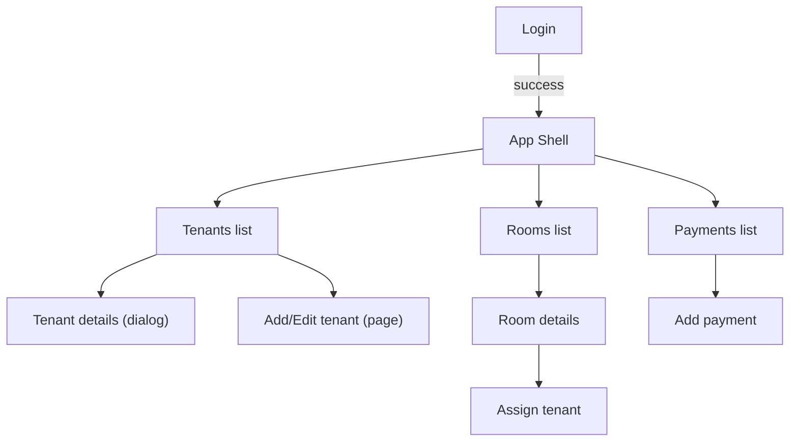

## Roomie Frontend Design (Mobile-first)

A sleek, modern, accessible UI built with a Material-inspired look. This spec defines the design system, navigation, layouts, screen blueprints, and states for the MVP.

---

## Design Principles
- Simple, focused, and fast
- Mobile-first; scales gracefully to tablet and desktop
- Familiar Material affordances with subtle motion
- Clear hierarchy and high-contrast text for readability
- Consistent component behaviors and states

---

## Visual Language
- Colors
  - Primary: #1976D2 (aligns with manifest theme)
  - Secondary: #455A64 (desaturated blue-grey)
  - Success: #2E7D32, Warning: #ED6C02, Error: #D32F2F, Info: #0288D1
  - Background: #FFFFFF (surface), #F7F9FC (alt surface)
  - Text: #111827 (primary), #4B5563 (secondary), #9CA3AF (tertiary)
  - Dividers: rgba(0,0,0,0.12)
- Typography
  - Base: 16px; scale: 12, 14, 16, 18, 20, 24, 32
  - Headings: H1 32/40, H2 24/32, H3 20/28
  - Body: 16/24; Caption: 12/18; Button: 14/20 (medium weight)
  - Font family: Roboto, system-ui
- Spacing & shape
  - 4px grid; common: 8, 12, 16, 24, 32
  - Radius: 8px (cards, inputs, buttons); 12px (images)
- Elevation & motion
  - Cards/dialogs: soft shadows; hover lifts +2dp
  - Motion: 150–200ms ease-out for enter, 120ms ease-in for exit

---

## Layout & Navigation
- App shell
  - Mobile: Top App Bar + Bottom Navigation (Tenants, Rooms, Payments, Settings)
  - Tablet: Top App Bar + Bottom Navigation; modal drawers and dialogs center-screen
  - Desktop: Top App Bar + Permanent Left Nav (rail) when width ≥ 1200px
- Responsive breakpoints
  - xs: <600, sm: ≥600, md: ≥900, lg: ≥1200, xl: ≥1536
- Containers
  - Content max width 1440px; gutters 16px (xs) → 24px (sm+) → 32px (lg)
  - Sticky action bars on long forms (bottom anchored)

---

## Core Screens

### 1) Login (`/login`)
- Layout: Centered card; logo/name, email, password, primary CTA, subtle link to Forgot password
- States: loading, invalid credentials, success redirect
- Accessibility: proper labels, keyboard nav, password visibility toggle

### 2) Tenants (`/tenants`)
- Header: Search input (debounced), primary action "Add Tenant"
- Content: List of tenant cards
  - Card: avatar/initial, name (bold), phone, room chip (or Unassigned), overflow menu (View, Edit, Delete)
- Empty: Illustration-free message + "Add Tenant" CTA
- Loading: Skeleton list
- Filters: Quick room filter (chip set) later; basic search now

Tenant details (Dialog)
- Content: name, phone, address, room chip; ID image preview (full-width card)
- Actions: Edit, Close

Add/Edit tenant (Page)
- Fields: Full name, Phone (optional), Address, ID upload (file/camera), Preview
- Sticky actions: Cancel, Save
- Validation: required name & address; file type image/*, size ≤ 5MB

### 3) Rooms (`/rooms`)
- Header: "Add Room"
- Content: Grid of room cards (1 col mobile, 2 col tablet, 3 col desktop)
  - Card: Room number, capacity, occupancy pill, overflow menu (Edit, Delete)
  - Tap → Room details

Room details (Page)
- Sections: Room header (number, capacity), Occupants list
- Assign tenant flow: "Assign tenant" button → Select tenant (searchable list) → Confirm
- Actions: Edit room, Delete room (with confirm)

### 4) Payments (`/payments`)
- Header: Date range + Tenant filter + "Add Payment"
- Content: List with amount, tenant, room (optional), paid_at, note
- Empty: Explain there are no records; CTA to Add Payment
- Loading: Skeleton list

Add payment (Dialog or Page)
- Fields: Tenant (required), Room (optional), Amount (required), Date (default today), Note
- Validation: positive amount
- Success: toast + return to list/top of list

---

## Assignments & Rent Type
- Assignment captured in room details or via tenant quick action
- Fields include: contract expiry date, move-in date, rent type (Segmented: Daily / Monthly), deposits/advance, person count, total amount
- UI shows rent type prominently on room/tenant chips (e.g., Monthly, Daily)

---

## Components & Patterns
- App Bar: screen title, actions (Add), profile/avatar menu
- Bottom Navigation (mobile): Tenants, Rooms, Payments, Settings
- Cards: subtle elevation, 8px radius, internal 12–16px padding
- Lists: 56–72px row height; ripple/hover; focus ring visible
- Forms: outlined inputs; helper/error text; required asterisk; sticky action bar
- Dialogs: 560px max width; responsive to full-screen on xs if content is tall
- Chips: status (Active/Inactive), room, filters; avoid overuse
- Toasts/Snackbars: bottom-center on mobile; bottom-right on desktop; auto-hide ~3s
- Empty states: icon + short guidance + key CTA
- Loading: skeletons for lists/cards, spinners for actions

---

## Accessibility
- Color contrast AA minimum (4.5:1 body, 3:1 large text)
- Visible focus outlines; keyboard navigable forms and menus
- Labels for inputs and icons; alt text for images
- Reduce motion setting respected

---

## Performance
- Debounced search; virtualize long lists if needed later
- Image uploads: constrain preview to fixed dimensions; lazy-load
- Paginate lists (cursor-based later; simple page params now)

---

## PWA Touchpoints
- Install prompt guidance (educational banner after user engagement)
- App icon, splash background consistent with primary color
- Offline fallback page (post-MVP)

---

## Navigation Map (Mermaid)

---

## MVP Checkpoints (Frontend)
- Auth screens complete and responsive
- Tenants list + details + create/edit with image upload
- Rooms list + details + assign tenant flow
- Payments list + add payment
- Global navigation (bottom nav mobile, left rail desktop)
- Empty/loading/error states for each screen

---

## Notes for Implementation (no code)
- Use MUI components to match Material affordances; prefer system defaults before custom CSS
- Keep bottom actions sticky, not floating, for consistent reachability
- Apply consistent paddings/margins per spacing scale; avoid one-off sizes
- Keep dialogs short; promote to full page for long forms on mobile 